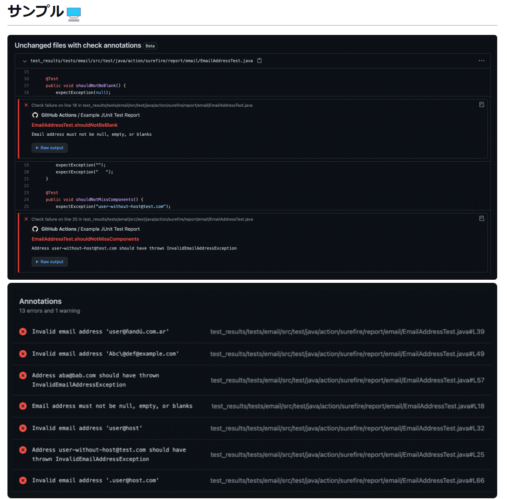

# Javaコース最終課題

## 要件
- CRUD処理をすべて備えたREST APIを作成する
- テストコードを作成する (単体テスト～結合テストまで)
- 自動で単体テストを実行するCIを作成する (GitHub Actions)

## こだわり
- Record Classの使用[（リンク）](https://github.com/yoshiki-bull/Last-lecture-Java/pull/10#issue-1725112384)
-

## 使用技術
- Java 17.0.5
- Spring Boot 3.0.4
- OpenAPI Specification 3.0.0
- O/Rマッパー
  - MyBatis 3.0.0
- Docker
  - MySQL 8.0

## IDE
- IntelliJ IDEA

## 成果物
### GitHub Actionsを用いた自動CI

- **Event**
```
on:
  push:
    branches: [main]
  pull_request:
```

- **Runner**
```
 runs-on: ubuntu-latest
```

- **Step 1: リポジトリのチェックアウト**
```
uses: actions/checkout@v3
```

- **Step 2: 指定したオプションのJDKをセットアップする**
```
uses: actions/setup-java@v3
  with:
    java-version: '17'
    distribution: 'temurin'
    cache: 'gradle'
```

- **Step 3: Dockerコンテナを起動させる**
```
run: docker compose up -d
```

- **Step 4: testタスクを実行する**
```
run: ./gradlew test
```
| 生成物 | 詳細 |
|---| --- |
| コンパイルされたソースコード | クラスファイルが<br>`build/classes/test/`配下に生成される |
| テスト結果レポート | テストの実行結果をまとめたレポート`index.html`が<br>`build/reports/tests`配下に生成される |
| JUnitテストレポート | JUnitテストのテストレポートがXML形式で<br>`**/build/test-results/test/TEST-*.xml`として生成される |

- **Step 5: JUnitテストレポートを収集しテスト結果をPRのChecksに報告する**
```
uses: mikepenz/action-junit-report@v3
with:
  report_paths: '**/build/test-results/test/TEST-*.xml'
```

| 生成物 | 詳細                                                                                              |
| --- |-------------------------------------------------------------------------------------------------|
| Checks | PRのChecksに結果を表示してくれる                                                |
| テスト成功時 | テスト成功時は`Summary`に`Artifacts`を生成する                               |
| テスト失敗時 | テスト失敗時は`Summary`に`Annotations`を生成し、<br>どのテストが失敗してるか教えてくれる(PR上で確認可能)  |
