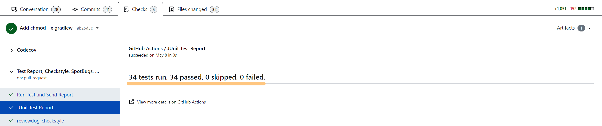
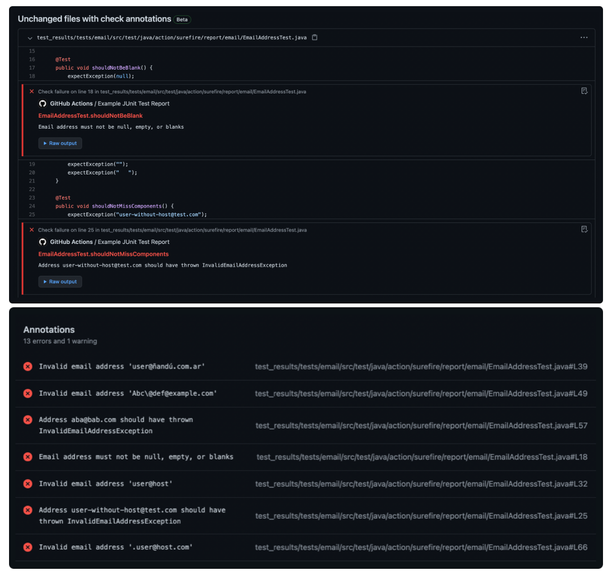
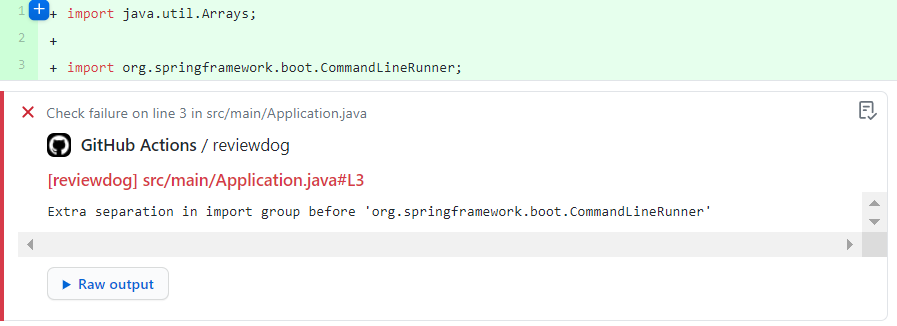
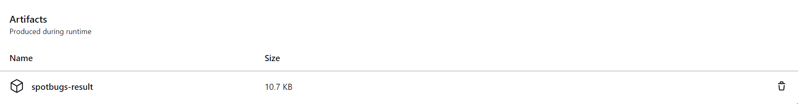
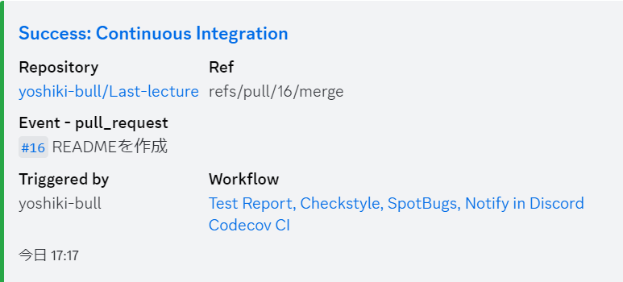

# Javaコース最終課題

## 要件
- CRUD処理をすべて備えたREST APIを作成する
- テストコードを作成する (単体テスト～結合テストまで)
- 自動で単体テストを実行するCIを作成する (GitHub Actions)

## こだわり
- Record Classの使用[（リンク）](https://github.com/yoshiki-bull/Last-lecture-Java/pull/10#issue-1725112384)
- 3層アーキテクチャに基づいた設計[(リンク)](https://terasolunaorg.github.io/guideline/current/ja/Overview/ApplicationLayering.html)

## 使用技術
- Java 17.0.5
- Spring Boot 3.0.4
- OpenAPI Specification 3.0.0
- O/Rマッパー
  - MyBatis 3.0.0
- Docker
  - MySQL 8.0

## IDE
- IntelliJ IDEA

## 成果物

### ディレクトリ構造

```
└── com
    └── udemy
        └── videolist
            ├── VideoListApplication.java
            ├── application
            │   ├── controller
            │   │   └── VideoController.java
            │   ├── exception
            │   │   ├── VideoNotFoundException.java
            │   │   └── VideoNotFoundExceptionHandler.java
            │   ├── form
            │   │   ├── CreateForm.java
            │   │   └── UpdateForm.java
            │   └── response
            │       ├── VideoCreateResponse.java
            │       ├── VideoResponse.java
            │       └── VideoUpdateResponse.java
            ├── domain
            │   ├── model
            │   │   └── Video.java
            │   ├── repository
            │   │   └── VideoRepository.java
            │   └── service
            │       ├── VideoService.java
            │       └── VideoServiceImpl.java
            └── infrastructure
                ├── mapper
                │   └── VideoMapper.java
                └── repository
                    └── VideoRepositoryImpl.java
```

### GitHub Actionsを用いた自動CI

- **Event**

```
on:
  push:
    branches: [main]
  pull_request:
```
<br>

- **Runner**

```
 runs-on: ubuntu-latest
```
<br>

- **Step 1: リポジトリのチェックアウト**

```
uses: actions/checkout@v3
```
<br>

- **Step 2: 指定したオプションのJDKをセットアップする**

```
uses: actions/setup-java@v3
```
<br>

- **Step 3: Dockerコンテナを起動させる**

```
run: docker compose up -d
```
<br>

- **Step 4: testタスクを実行する**

```
run: ./gradlew test
```

<details>
<summary>機能</summary>

| 機能              | 説明                                                                         |
|-----------------|----------------------------------------------------------------------------|
| コンパイルされたソースコード  | クラスファイルが<br>`build/classes/test/`配下に生成される                                  |
| テスト結果レポート       | テストの実行結果をまとめたレポート`index.html`が<br>`build/reports/tests`配下に生成される            |
| JUnitテストレポート    | JUnitテストのテストレポートがXML形式で<br>`**/build/test-results/test/TEST-*.xml`として生成される |
</details>
<br>

- **Step 5: JUnitテストレポートを収集しテスト結果をPRのChecksに報告する**

```
uses: mikepenz/action-junit-report@v3
```

<details>
<summary>機能</summary>

| 機能      | 説明                                                                               |
|---------|----------------------------------------------------------------------------------|
| Checks  | PRのChecksに結果を表示してくれる                                 |
| テスト失敗   | テスト失敗時に`Annotations`を生成し、<br>PR上でどのテストが失敗したのか教えてくれる  |
</details>
<br>

- **Step 6: lintツール(Checkstyle)でコーディングスタイルに問題がないか確認する**

```
uses: nikitasavinov/checkstyle-action@master
```

<details>
<summary>機能</summary>

| 機能            | 説明                                                                                         |
|---------------|--------------------------------------------------------------------------------------------|
| Checkstyle    | CheckstyleはJavaのソースコードがコーディング規約に<br>即しているかどうか確認するためのlint(静的解析)ツール。                         |
| Checkstyleの実行 | このアクションは指定したCheckstyleを実行する。                                                               |
| Reviewdog     | Reviewdogはlintツールの結果を受け取り、<br>PRの差分に対してコメントを生成してくれるツール。  |
| Reviewdogの利用  | このアクションはReviewdogにCheckstyleの実行結果を送信する。                                                    |
</details>
<br>

- **Step 7: テストカバレッジを収集しCodecovにアップロードする**

```
uses: codecov/codecov-action@v3
```

<details>
<summary>機能</summary>

| 機能         | 説明                                                                                           |
|------------|----------------------------------------------------------------------------------------------|
| Codecov    | テストカバレッジを収集しグラフやレポートとして可視化するためのサービス。                                                         |
| Codecovの利用 | このアクションは`build/reports/jacoco/test/jacocoTestReport.xml`から<br>テストカバレッジを収集し、Codecovにアップロードする。 |
</details>
<br>

- **Step 8: lintツール(SpotBugs)でソースコードにバグパターンがないか確認する**

```
run: ./gradlew spotbugsMain
```
<br>

- **Step 9: SpotBugsの結果をGitHub上にアップロードする**

```
uses: actions/upload-artifact@v1
```
<details>
<summary>機能</summary>

| 機能        | 説明                                                                                               |
|-----------|--------------------------------------------------------------------------------------------------|
| Artifacts | このアクションは指定したファイルやディレクトリを<br>アーティファクトとしてパッケージ化しGitHub上にアップロードする  |
</details>
<br>

- **Step 10: CIの結果をDiscordに通知する**

```
uses: sarisia/actions-status-discord@v1
```
<details>
<summary>機能</summary>

| 機能         | 説明                                                                                      |
|------------|-----------------------------------------------------------------------------------------|
| Discordに通知 | このアクションはCI/CDの結果をDiscordに通知してくれる<br>(オプションが豊富)  |
</details>
