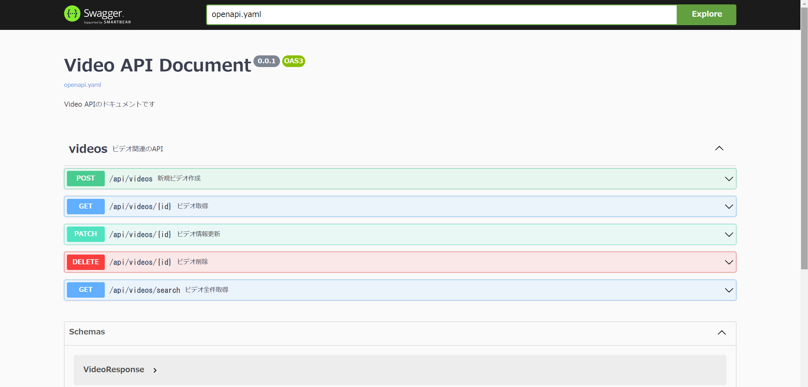
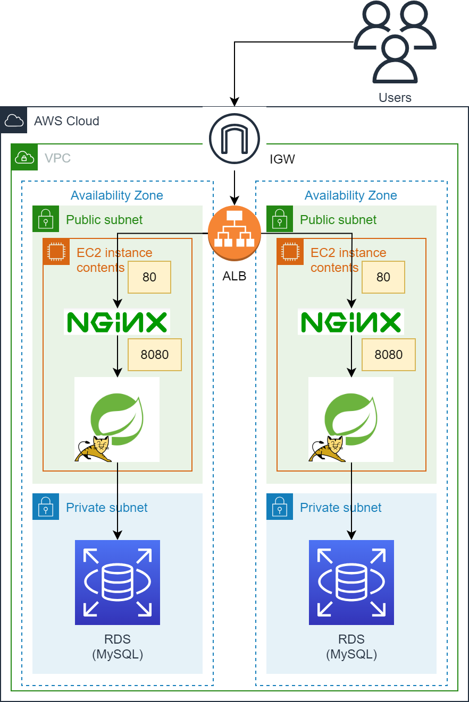
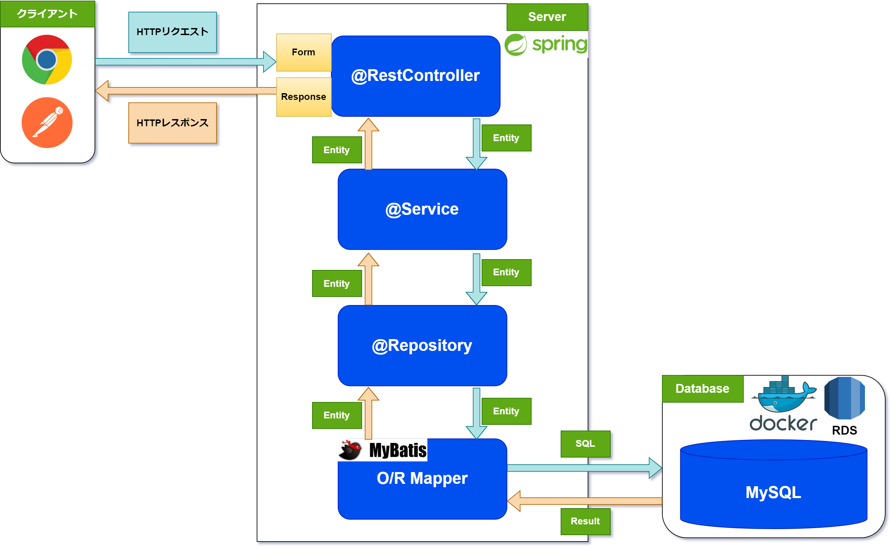
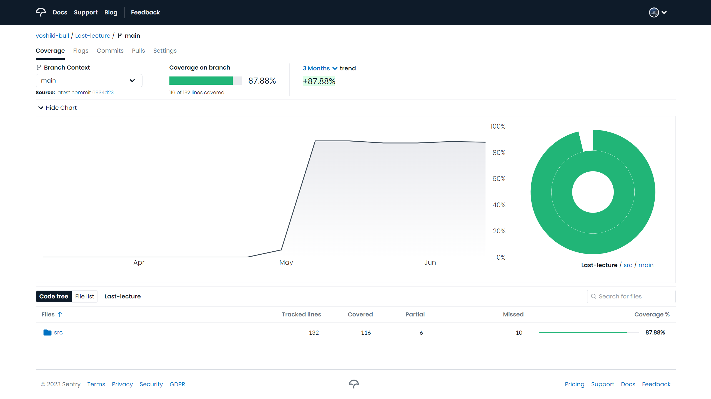
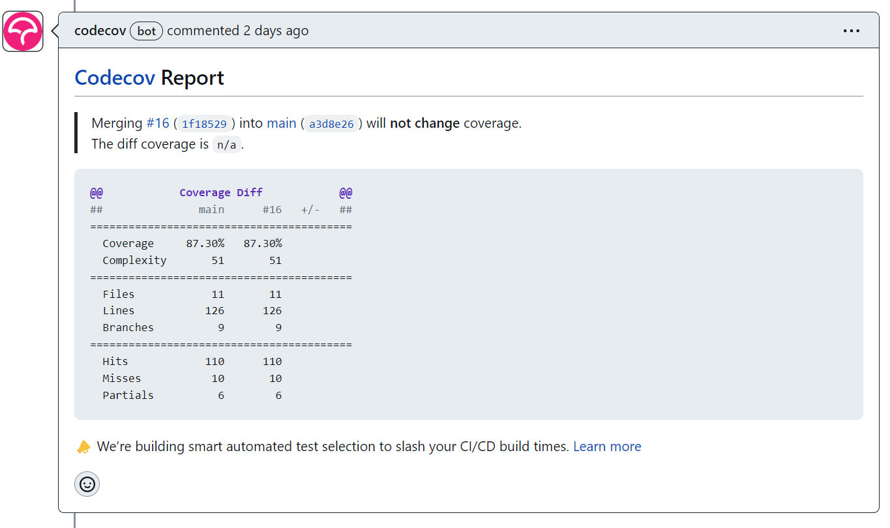

# Video-API

  

[](https://codecov.io/gh/yoshiki-bull/Last-lecture)

[](https://skillicons.dev)  

[](https://skillicons.dev)  


## API概要
Udemyを参考にした動画教材のCRUD処理を想定したRESTAPIです。

## 要件
- CRUD処理をすべて備えたREST APIの作成
- テストコードを書く
- テストコードを自動で実行するCIの構築(GitHub Actions)
- 3層アーキテクチャに基づいた設計 [(PRリンク)](https://github.com/yoshiki-bull/Last-lecture/pull/19#issue-1750970087)  
- APIをEC2上にデプロイする [(PRリンク)](https://github.com/yoshiki-bull/Video-API/pull/25#issue-1761688461)

## 使用技術
- Java 17.0.5
- Spring Boot 3.0.4
- OpenAPI Specification 3.0.0
- O/Rマッパー
  - MyBatis 3.0.0
- Docker
  - MySQL 8.0
- AWS
  - VPC
  - EC2
  - RDS

## IDE
- IntelliJ IDEA

## 今後に向けての気づき・学び
- **英語スキルは必須**  
プログラミング学習およびシステム開発の難しさは、英語や聞いたこともないカタカナが頻出するところだと思います。  
英語ができれば、単語からある程度イメージができるものを英語ができなければいちいち英語の意味から調べる手間が増えます。  
「公式ドキュメントを読む」「エラー文を読む」「エラーを解決するためにトラブルシューティング方法を調べる」  
これらは開発をする上で必ず求められると思いますし、英語が読めなければ困る場面がでてくると思います。  
なので、英語も勉強してます🙋‍♂️  
<br>

- **やればできる**  
私はこのシンプルなAPIを作るだけでもかなり苦労しました。  
中でも「テストコードを書く」「CIの構築」「APIのデプロイ」は単にデータを処理するコードを書くこととはまた毛色が異なり、  
スタブやモック、アサートといった新しいキーワード、様々なライブラリの活用、新しいツールの使用など  
学習することが多く理解に苦しみ、詰まる時も多々ありました。  
しかし、そういった状況下の中でも一旦状況を整理しキーワードを洗い出すなどして乗り越えてきました。  
また、見当もつかないような場合には人を頼ることも大切だと考えてます。

## 今後の展望
- フロントサイドの実装
- 複雑なデータベース設計
- 実用的なWebアプリケーションの作成

## 成果物

### [API仕様書(Swagger UI)](https://yoshiki-bull.github.io/Video-API/)

- **[API仕様書をGitHub Pagesにホスティングするまでの手順](https://github.com/yoshiki-bull/Last-lecture/pull/23)**



---

### インフラ構成図



---

### アプリケーション概略図



---

### ディレクトリ構造

```
└── com
    └── udemy
        └── videolist
            ├── VideoListApplication.java
            ├── application
            │   ├── controller
            │   │   └── VideoController.java
            │   ├── exception
            │   │   ├── VideoNotFoundException.java
            │   │   └── VideoNotFoundExceptionHandler.java
            │   ├── form
            │   │   └── VideoForm.java
            │   └── response
            │       ├── VideoCreateResponse.java
            │       ├── VideoResponse.java
            │       └── VideoUpdateResponse.java
            ├── domain
            │   ├── model
            │   │   └── Video.java
            │   ├── repository
            │   │   └── VideoRepository.java
            │   └── service
            │       ├── VideoService.java
            │       └── VideoServiceImpl.java
            └── infrastructure
                ├── mapper
                │   └── VideoMapper.java
                └── repository
                    └── VideoRepositoryImpl.java

```

---

### テストコード
- **Serviceテスト**  
  [テストコード](https://github.com/yoshiki-bull/Last-lecture/blob/main/src/test/java/com/udemy/videolist/domain/service/VideoServiceImplTest.java)
- **Repositoryテスト**  
  [テストコード](https://github.com/yoshiki-bull/Last-lecture/blob/main/src/test/java/com/udemy/videolist/infrastructure/mapper/VideoMapperTest.java)
- **結合テスト**  
  [テストコード](https://github.com/yoshiki-bull/Last-lecture/blob/main/src/test/java/com/udemy/videolist/integrationtest/VideoRestApiIntegrationTest.java)
- **テストカバレッジ**



---

### GitHub Actionsを用いた自動CI

- **Event**

```
on:
  push:
    branches: [main]
  pull_request:
```
<br>

- **Runner**

```
 runs-on: ubuntu-latest
```
<br>

- **Step 1: リポジトリのチェックアウト**

```
uses: actions/checkout@v3
```
<br>

- **Step 2: 指定したオプションのJDKをセットアップする**

```
uses: actions/setup-java@v3
```
<br>

- **Step 3: Dockerコンテナを起動させる**

```
run: docker compose up -d
```
<br>

- **Step 4: testタスクを実行する**

```
run: ./gradlew test
```

<details>
<summary>機能</summary>

| 機能              | 説明                                                                         |
|-----------------|----------------------------------------------------------------------------|
| コンパイルされたソースコード  | クラスファイルが<br>`build/classes/test/`配下に生成される                                  |
| テスト結果レポート       | テストの実行結果をまとめたレポート`index.html`が<br>`build/reports/tests`配下に生成される            |
| JUnitテストレポート    | JUnitテストのテストレポートがXML形式で<br>`**/build/test-results/test/TEST-*.xml`として生成される |
</details>
<br>

- **Step 5: JUnitテストレポートを収集しテスト結果をPRのChecksに報告する**

```
uses: mikepenz/action-junit-report@v3
```

<details>
<summary>機能</summary>

| 機能     | 説明                                                                               |
|--------|----------------------------------------------------------------------------------|
| Checks | PRのChecksに結果を表示してくれる                                 |
| テスト失敗時 | テスト失敗時に`Annotations`を生成し、<br>PR上でどのテストが失敗したのか教えてくれる  |
</details>
<br>

- **Step 6: Checkstyleでコーディングスタイルに問題がないか確認する**

```
uses: nikitasavinov/checkstyle-action@master
```

<details>
<summary>機能</summary>

| 機能            | 説明                                                                                         |
|---------------|--------------------------------------------------------------------------------------------|
| Checkstyle    | CheckstyleはJavaのソースコードがコーディング規約に<br>即しているかどうか確認するためのlint(静的解析)ツール。                         |
| Checkstyleの実行 | このアクションは指定したCheckstyleを実行する。                                                               |
| Reviewdog     | Reviewdogはlintツールの結果を受け取り、<br>PRの差分に対してコメントを生成してくれるツール。  |
| Reviewdogの利用  | このアクションはReviewdogにCheckstyleの実行結果を送信する。                                                    |
</details>
<br>

- **Step 7: テストカバレッジを収集しCodecovにアップロードする**

```
uses: codecov/codecov-action@v3
```

<details>
<summary>機能</summary>

| 機能         | 説明                                                                                                                                                                                  |
|------------|-------------------------------------------------------------------------------------------------------------------------------------------------------------------------------------|
| Codecov    | テストカバレッジを収集しグラフやレポートとして可視化するためのサービス。                                                                                                                  |
| Codecovの利用 | このアクションは`build/reports/jacoco/test/jacocoTestReport.xml`から<br>テストカバレッジを収集し、Codecovにアップロードする。<br>GitHubと連携させることでPR作成時にカバレッジの変化量を教えてくれる。  |
</details>
<br>

- **Step 8: SpotBugsでソースコードにバグパターンがないか確認する**

```
run: ./gradlew spotbugsMain
```
<br>

- **Step 9: SpotBugsの結果をGitHub上にアップロードする**

```
uses: actions/upload-artifact@v1
```
<details>
<summary>機能</summary>

| 機能        | 説明                                                                                               |
|-----------|--------------------------------------------------------------------------------------------------|
| Artifacts | このアクションは指定したファイルやディレクトリを<br>アーティファクトとしてパッケージ化しGitHub上にアップロードする  |
</details>
<br>

- **Step 10: CIの結果をDiscordに通知する**

```
uses: sarisia/actions-status-discord@v1
```
<details>
<summary>機能</summary>

| 機能         | 説明                                                                                      |
|------------|-----------------------------------------------------------------------------------------|
| Discordに通知 | このアクションはCI/CDの結果をDiscordに通知してくれる<br>(オプションが豊富)  |
</details>
