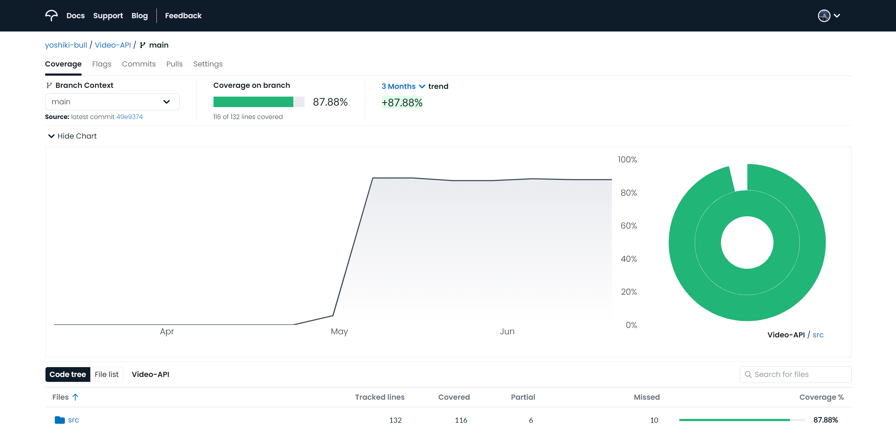

# Javaコース最終課題

[](https://codecov.io/gh/yoshiki-bull/Last-lecture)

[](https://skillicons.dev)

## 要件
- CRUD処理をすべて備えたREST APIを作成する
- テストコードを作成する (単体テスト～結合テストまで)
- 自動で単体テストを実行するCIを作成する (GitHub Actions)

## 独自実装
- Record Classの使用[（リンク）](https://github.com/yoshiki-bull/Last-lecture-Java/pull/10#issue-1725112384)
- 3層アーキテクチャに基づいた設計[(リンク)](https://github.com/yoshiki-bull/Last-lecture/pull/19#issue-1750970087)

## 使用技術
- Java 17.0.5
- Spring Boot 3.0.4
- OpenAPI Specification 3.0.0
- O/Rマッパー
  - MyBatis 3.0.0
- Docker
  - MySQL 8.0

## IDE
- IntelliJ IDEA

## 苦労したこと
- **開発周りの基本的な技術の理解**  
開発未経験であることはもちろんPCすらまともに扱う機会がなかったので  
ターミナルやGitの扱い方、ファイルの管理方法といった基本的な所から学ぶ必要がありました。  
そのため、Udemyや技術書などを存分に活用して学習を進めてきました。  
<br>

- **エラー文の解読**  
初めは読むことすらままならなかったエラー文も英語の意味から調べ、  
公式ドキュメントを積極的に参照するようにして今では大抵のエラーに太刀打ちできるようになりました。  
<br>

- **Javaの理解**  
技術書など読んでも中々腹落ちできなかったのですが、  
資格学習に取り組んだことで構文や概念などを理解することができました。
<br>

## 今後の展望
- AWSを用いたインフラ環境の構築およびデプロイ
- フロントサイドの実装
- 複雑なデータベース設計
- 実用的なWebアプリケーションの作成  

## 成果物

### [API仕様書(Swagger UI)](https://yoshiki-bull.github.io/Last-lecture/)

- **[API仕様書をGitHub Pagesにホスティングするまでの手順](https://github.com/yoshiki-bull/Last-lecture/pull/23)**


### アプリケーション概略図


### ディレクトリ構造

```
└── com
    └── udemy
        └── videolist
            ├── VideoListApplication.java
            ├── application
            │   ├── controller
            │   │   └── VideoController.java
            │   ├── exception
            │   │   ├── VideoNotFoundException.java
            │   │   └── VideoNotFoundExceptionHandler.java
            │   ├── form
            │   │   └── VideoForm.java
            │   └── response
            │       ├── VideoCreateResponse.java
            │       ├── VideoResponse.java
            │       └── VideoUpdateResponse.java
            ├── domain
            │   ├── model
            │   │   └── Video.java
            │   ├── repository
            │   │   └── VideoRepository.java
            │   └── service
            │       ├── VideoService.java
            │       └── VideoServiceImpl.java
            └── infrastructure
                ├── mapper
                │   └── VideoMapper.java
                └── repository
                    └── VideoRepositoryImpl.java

```

### テストコードを書く
- **Serviceテスト**  
  [テストコード](https://github.com/yoshiki-bull/Last-lecture/blob/main/src/test/java/com/udemy/videolist/domain/service/VideoServiceImplTest.java)
- **Repositoryテスト**  
  [テストコード](https://github.com/yoshiki-bull/Last-lecture/blob/main/src/test/java/com/udemy/videolist/infrastructure/mapper/VideoMapperTest.java)
- **結合テスト**  
  [テストコード](https://github.com/yoshiki-bull/Last-lecture/blob/main/src/test/java/com/udemy/videolist/integrationtest/VideoRestApiIntegrationTest.java)
- **テストカバレッジ**



### GitHub Actionsを用いた自動CI

- **Event**

```
on:
  push:
    branches: [main]
  pull_request:
```
<br>

- **Runner**

```
 runs-on: ubuntu-latest
```
<br>

- **Step 1: リポジトリのチェックアウト**

```
uses: actions/checkout@v3
```
<br>

- **Step 2: 指定したオプションのJDKをセットアップする**

```
uses: actions/setup-java@v3
```
<br>

- **Step 3: Dockerコンテナを起動させる**

```
run: docker compose up -d
```
<br>

- **Step 4: testタスクを実行する**

```
run: ./gradlew test
```

<details>
<summary>機能</summary>

| 機能              | 説明                                                                         |
|-----------------|----------------------------------------------------------------------------|
| コンパイルされたソースコード  | クラスファイルが<br>`build/classes/test/`配下に生成される                                  |
| テスト結果レポート       | テストの実行結果をまとめたレポート`index.html`が<br>`build/reports/tests`配下に生成される            |
| JUnitテストレポート    | JUnitテストのテストレポートがXML形式で<br>`**/build/test-results/test/TEST-*.xml`として生成される |
</details>
<br>

- **Step 5: JUnitテストレポートを収集しテスト結果をPRのChecksに報告する**

```
uses: mikepenz/action-junit-report@v3
```

<details>
<summary>機能</summary>

| 機能     | 説明                                                                               |
|--------|----------------------------------------------------------------------------------|
| Checks | PRのChecksに結果を表示してくれる                                 |
| テスト失敗時 | テスト失敗時に`Annotations`を生成し、<br>PR上でどのテストが失敗したのか教えてくれる  |
</details>
<br>

- **Step 6: Checkstyleでコーディングスタイルに問題がないか確認する**

```
uses: nikitasavinov/checkstyle-action@master
```

<details>
<summary>機能</summary>

| 機能            | 説明                                                                                         |
|---------------|--------------------------------------------------------------------------------------------|
| Checkstyle    | CheckstyleはJavaのソースコードがコーディング規約に<br>即しているかどうか確認するためのlint(静的解析)ツール。                         |
| Checkstyleの実行 | このアクションは指定したCheckstyleを実行する。                                                               |
| Reviewdog     | Reviewdogはlintツールの結果を受け取り、<br>PRの差分に対してコメントを生成してくれるツール。  |
| Reviewdogの利用  | このアクションはReviewdogにCheckstyleの実行結果を送信する。                                                    |
</details>
<br>

- **Step 7: テストカバレッジを収集しCodecovにアップロードする**

```
uses: codecov/codecov-action@v3
```

<details>
<summary>機能</summary>

| 機能         | 説明                                                                                                                                                                                  |
|------------|-------------------------------------------------------------------------------------------------------------------------------------------------------------------------------------|
| Codecov    | テストカバレッジを収集しグラフやレポートとして可視化するためのサービス。                                                                                                                  |
| Codecovの利用 | このアクションは`build/reports/jacoco/test/jacocoTestReport.xml`から<br>テストカバレッジを収集し、Codecovにアップロードする。<br>GitHubと連携させることでPR作成時にカバレッジの変化量を教えてくれる。  |
</details>
<br>

- **Step 8: SpotBugsでソースコードにバグパターンがないか確認する**

```
run: ./gradlew spotbugsMain
```
<br>

- **Step 9: SpotBugsの結果をGitHub上にアップロードする**

```
uses: actions/upload-artifact@v1
```
<details>
<summary>機能</summary>

| 機能        | 説明                                                                                               |
|-----------|--------------------------------------------------------------------------------------------------|
| Artifacts | このアクションは指定したファイルやディレクトリを<br>アーティファクトとしてパッケージ化しGitHub上にアップロードする  |
</details>
<br>

- **Step 10: CIの結果をDiscordに通知する**

```
uses: sarisia/actions-status-discord@v1
```
<details>
<summary>機能</summary>

| 機能         | 説明                                                                                      |
|------------|-----------------------------------------------------------------------------------------|
| Discordに通知 | このアクションはCI/CDの結果をDiscordに通知してくれる<br>(オプションが豊富)  |
</details>
